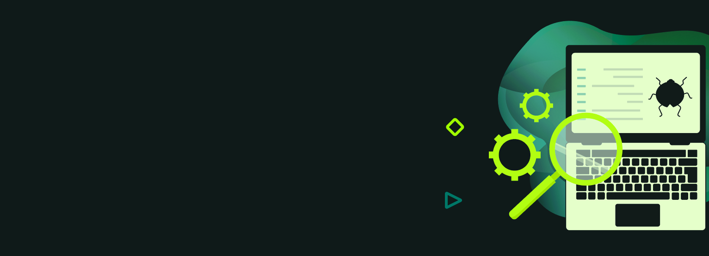

<!DOCTYPE html>
<html lang="en">
<head>
    <meta charset="UTF-8">
    <meta name="viewport" content="width=device-width, initial-scale=1.0">
    <title>My Portfolio</title>
    <link rel="stylesheet" type="text/css" href="style.css">
</head>
<body>

<!-- Шапка -->
<h1>Всем здрасть</h1>

<!-- Информация обо мне -->
<h2>Здесь будет информация обо мне</h2>

<!-- Языки и инструменты -->
<h2>Languages and Tools</h2>

<i class="devicon-selenium-plain selenium-icon" title="Selenium"></i>
<i class="devicon-postman-plain postman-icon" title="Postman"></i>

<i class="devicon-junit-plain-wordmark junit5-icon" title="JUnit 5"></i>

</body>
</html>

